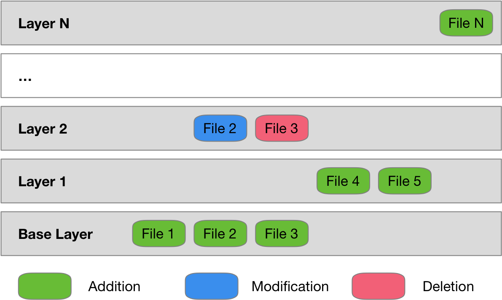

You created a running container from a container image. The container image you used was pulled down from an image registry. Although there are lots of container images available for commonly used software applications, it is more likely that you will want to create a container image for your own application.

A container image was previously described as being a packaging mechanism for distributing an application, including the application software, operating system files, libraries and other software required by the application to run.

In that sense, a container image can be seen as being a fancy form of tar file or zip file which is unpacked to populate a file system. It is though a bit more complicated than that.

Rather than being a single package containing all the required files, a container image is a set of packages, where each contains the files from a single layer of the container image.

For each container image, one starts out with a base layer. This would usually consist of all the base operating system files, applications and libraries.

On top of this additional layers are added. In each layer you might add more files, modify existing files, or delete files.

When existing files are modified or deleted, it is not the original file in the lower layer that is changed. Instead, for a modification, a new copy of the file with the changes exists in the new layer, with the original in the lower layer still existing as it was. In the case of a file deletion, the metadata of the layer records that the file was deleted in that layer, with the original still existing in the lower layer.

Changes or deletions are handled in this way because each layer is immutable. The only way to affect a change is in a new layer.

When the container image is used in creating a container, a special type of file system is used which overlays each layer from the container image on top of each other to form a composite view of the layers.

This final composite view is itself still read only. For changes made to files within the container, they will exist in yet another layer which exists for the life of the container.

The actual specification for the container image format is defined by the [OCI Image Format Specification](https://github.com/opencontainers/image-spec). How the image is unpacked, interpreted and used to run an application in a container is defined by the [OCI Runtime Specification](https://github.com/opencontainers/runtime-spec). Both specifications are managed under the governance of the [Open Container Initiative](https://www.opencontainers.org/), a Linux Foundation sponsored organisation.
