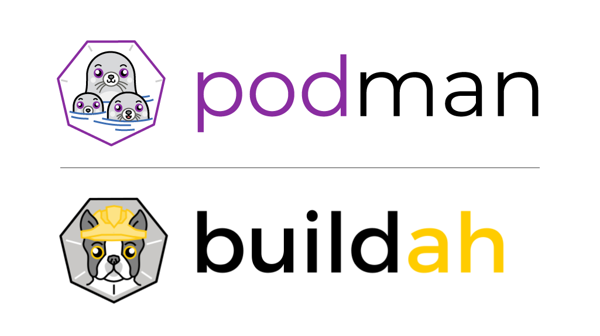

Containers are a lightweight form of OS-level virtualization. It enables a set of application processes to be run in their own isolated environment, without the need to run a full operating system.

In this workshop you will learn how to build container images and run them. The workshop will use `podman` and `buildah`, tools which provide an alternative to `docker`, for building [OCI compliant container images](https://www.opencontainers.org/).

In addition to learning about `podman` and `buildah`, the workshop will cover a range of best practices around designing and implementing container images to ensure they are secure, techniques for configuring containers, and a range of other issues that need to be considered when building container images.

For the workshop we will be using a Python web application, and as a result will include various best practices for building container images to support the use of Python.
